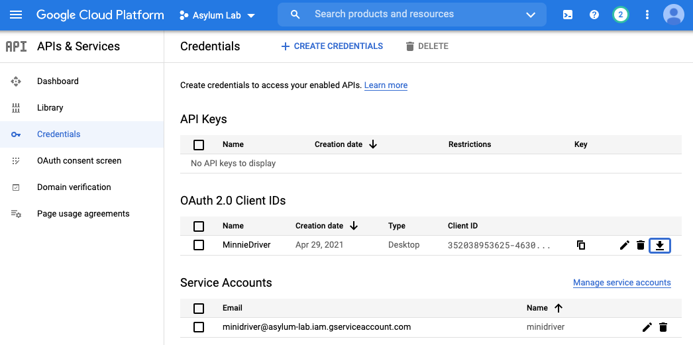

# Rubberstamp

This is a recipe for continuously updating a wax site from Google drive.
The point is to allow multiple people to collaborate on a project simultaneously,
and for the webpage to be continuously updated.

It's called 'rubberstamp' because

1. It just robotically approves any changes that any user makes in Google, and
2. You *could* use a rubber stamp to make a wax seal, but it wouldn't work
   especially well.

The python components are called `minidriver.py` because they're a more
general set of interfaces to Google Drive that should be useful if
you want to build minimal computing projects with people who use Google Docs,
not markdown. Sometimes you gotta meet people where they are.

## Summary

0. Install the program: `pip install git+https://github.com/bmschmidt/rubberstamp`

1. Add a key called `google_drive_id` or `google_drive_ids` to any
   csv, image, or markdown document in your Jekyll `_config.yaml` that
   you want to maintain on Google Drive.

2. Create a `credentials.json` file in your Google accounts to be able
   to access them.

3. Run `rubberstamp my_wax_project 55` in your terminal.

Voila! Now remote Google
Drive spreadsheets and docs will be synced to your folders every 55
seconds until you end the process.

## Installation

The executable is bundled into a Python program that you can install from
github.

```
pip install git+https://github.com/bmschmidt/rubberstamp
```

If your	computer has Python 2 installed	(as do some Macs),
you may	need to	run:
`pip3 install git+https://github.com/bmschmidt/rubberstamp`
instead.

This will install an executable	called 'rubberstamp' into
your system.

## Detailed instructions

1. Create files in Google Drive, including potentially
   1. CSVs about your collections.
   2. Folders with images.
   3. Exhibits text as doc files.

2. Create an [OAuth client ID in the Google API settings.](https://developers.google.com/identity/protocols/oauth2)
   This stores information about your client. If it asks, you only need to give
   read access--the point here is to let python access documents that you can
   access while logged into Google.
   I find this to be the hardest part,
      because it takes you into the part of the Google settings where I always
      worry I might accidentally set up a server.

      

   Ultimately, you'll end up at the screen above. You want the Oauth 2.0 Client IDs.

   **Note** If using version control, you should change your .gitignore to include
   `credentials.json` and `token.pickle`, because they include private information
   about your Google account. If running this on a webserver, make sure the
   permissions on this file don't accidentally allow them to be downloaded (this
   is unlikely.)

3. Edit your Wax project's base _config.yml to include information about
   where to find the associated documents on Google Drives.

   You can place a key called `google_drive_id` inside any field in collections
   or in menu['Exhibits']. (For now, you have to edit the source code to pull
   anywhere else; I'm curious where it might be needed.) If so, rather
   using local markdown/images/csvs to generate the wax site, the
   relevant files will be retrieved from Google Drive. To avoid filename confusion,
   you have to use the Google Drive ID, which creates inscrutable file names.
   But it's not so hard to find (it's just the bit at the end of any URL in
   Google.) The precise strategy will differ by file type; for images, an
   entire folder with subfolders on Drive will be fetched. For exhibits,
   you should specify a drive folder with *documents* in it, which will be
   converted from Google Docs to Markdown through Pandoc. For metadata,
   give the path to a Google Sheet; you may optionally put a slash at the end,
   (e.g.: '1gbPtPQtHpOClQXJ8CjMGGj4B6kTN_UkpX6XrCCCD278/Elijah') in which case
   the tab with that name will be fetched.

   If you use `google_drive_ids` instead of `google_drive_id`, multiple
   directories will be synced to the same root. (If, say, multiple students
   are uploading to their own Google Drive.)

  ```
     collections:
       exhibits:
         output: true
       nara: # name of collection
         output: true # makes sure pages are output as html files
         layout: 'generic_collection_item' # the layout for the pages to use
         metadata:
           google_drive_id: '1gbPtPQtHpOClQXJ8CjMGGj4B6kTN_UkpX6XrCCCD278/main' #
           # The above is a google Sheets file. /main at the end means "use the sheet 'main'"
           source: 'nara.csv' # <- The file for wax to use. This will be **created**
           # or *overwritten* from the Google Sheet; there's a one-way flow
           # of information from Google to here, so you should not edit this
           # document directly.
         images:
           source: 'raw_images/nara' # <- This dir will be created if it doesn't exist.
           google_drive_ids:
             - '1RofzC0sDYoUeiSu4DOveDEAQTakaG12D' # <- A Google
                # drive *folder*; all files in this, including subdirectories,
                # will be synced to the dir above if the info is out of date.
             - 'Fadsflkj54207gDGsdnjf50287353fDFF' # <- A second Gdrive folder
                # Images here will also be synced into raw_images/nara. Filenames
                # are the ids, as in Wax.
      [...] {more Jekyll Stuff}
      menu:
        - label: 'About'
          sub:
            - label: 'Wax'
              link: '/about/'
            - label: 'Credits'
              link: '/credits/' #<- All unchanged.
        - label: 'Exhibits'
          sub:
            - label: "Ben's Story" # The Menu label.
              link: '/exhibits/ben/' # A destination for the exhibit.
              google_drive_id: 1-BTA9-vWWMgH33KhtDFqxugxLbRrp-lTmp5d1zD5SHg
              # The Google Docs *Document* with text of a narration. This will
              # turn into Markdown at /exhibits/ben/. You can use liquid templates
              # in Google Docs directly.

            - label: "Mario's Story"
              link: '/exhibits/mario/'
              google_drive_id: 1RY4chFp81ENysfy8cg_-Sel-Z9EDIs5G_IKGuR36mY8  
              # A Second exhibit in the "Exhibits" tab.
  ```

### Inline images

Inline exhibits can include Wax images by using the pid (filename) of the image.

For example, if the following is in your Google Doc:

```

```

The corresponding image will be inserted in that place in your document.

### Dependencies

This runs in Python; it's tested in I think 3.7, and probably requires
a fairly modern version of Python 3.0. You also need the packages
`pypandoc` and `openpyxl` (for parsing documents and spreadsheets,
respectively), `pyyaml` (for config parsing), as well as some Google API tools.

They should be installed by the pip command, but you can do it manually
like so:

```
pip install pypandoc openpyxl pyyaml
pip install --upgrade google-api-python-client google-auth-httplib2 google-auth-oauthlib
```

# SeMinnieTiC versioning

Semantic versioning is a well-regarded strategy for controlling releases. The
basic idea of semantic versioning is that you always keep the version number
below 1 because anything higher involves a strong contract with your users that,
let's be honest, you're not going to follow through on.

This project (like all minidriver projects) uses
a related but improved strategy known as SeMinnieTiC versioning. In SeminnieTec
versioning, every commit message must end with the phrase "How do you like them
apples?" (or at least the last three words). More significant changes should
be indicated by increasing the stress on "them"; e.g., a new feature addition should be
"`How do you like *them* apples?`," major additions to the API
should be "`How do you like **them** apples?`", and anything that breaks
backwards compatibility must be indicated with the commit
"`How do you like ***them*** apples?`" so that users are aware of the change.

In order to get the semantic versioning number, you just cat out the git log and
work out the number of changes in each class to get a number like "4.3.2".
If users want
guarantees about API stability, they have to do this themselves.
You can also refer to major versions by lining them up against
[Minnie Driver's Wikipedia filmography](https://en.wikipedia.org/wiki/Minnie_Driver#Film).
Version 0 is "The Zebra Man", Version 1 is "That Sunday," etc.

The C at the end of SeMinnieTiC is pronounced the opposite of the X in LaTeX.


# Code of Conduct

Follow the Wax Tasks [code of conduct](https://github.com/minicomp/wax_tasks/blob/main/CODE_OF_CONDUCT.md)
Also, see the section above. If you find the above to be "abusive, harassing, or otherwise unacceptable behavior",
I guess I'll evaluate your pull request on the merits...
